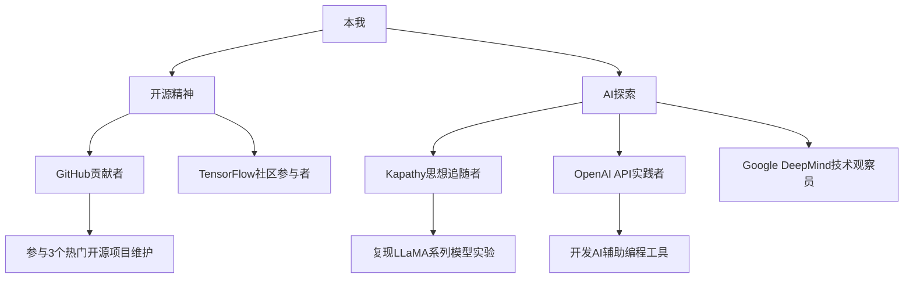

# 🌟 关于这个穿梭在代码与星辰间的追光者

> “当指尖敲击键盘的频率与心跳同频，当算法的脉络在脑海中绽放成星图 —— 这便是属于我的战场！”

## 👾 核心身份解码

* **主职业**：代码世界的「次元突破者」（aka 全栈程序员），擅长用 Python 构筑数据洪流，用 JavaScript 编织交互魔法，坚信每一行代码都能撕裂平庸的边界

* **副职业**：马拉松赛道上的「极限挑战者」，曾在 3 小时内征服 42.195 公里的征途，把每一次呼吸都化作突破极限的战吼

* **隐藏职业**：户外领域的「荒野漫游者」，背着背包闯过雪山、穿过森林，在星空下搭建帐篷时，总觉得下一秒会触发隐藏任务

## ⚡ 技术信仰清单

### 🔗 技术宇宙网络图

### 🔥 热血技术宣言

1. **开源即正义**：坚信优质代码不该被高墙囚禁，已在 GitHub 提交超过 500 次 PR，其中 2 个项目星标突破 1000+，目标是让自己写的工具能成为他人征途上的「补给包」

2. **AI 是星辰大海**：从复现 Kapathy 的「Neural Networks, Man!」博客实验，到用 OpenAI API 开发自动生成注释的插件，再到研究 Google 的 PaLM 模型架构，每一步都在追逐人工智能的微光

3. **代码要带热血属性**：写的项目不仅要能跑通，还要有「中二感」的注释和文档，比如给排序算法起名叫「闪电光速拳排序」，给错误处理模块命名为「次元屏障防御系统」

## 🚀 次元爱好集合

* **马拉松**：目标是跑完「六大满贯」，把每一场马拉松都当作一次「拯救世界的征途」，补给站就是「中途补给点」，冲线瞬间就是「战胜 BOSS 的时刻」

* **户外露营**：喜欢在山顶搭建帐篷，夜晚用代码记录星空轨迹，曾在海拔 4000 米的地方调试 AI 星空识别程序，实现了「在星空下训练 AI，让 AI 识别星空」的闭环

* **二次元**：重度动漫爱好者，最爱《进击的巨人》里「为了自由而战」的精神，并把这种精神融入代码开发 —— 遇到 BUG 不逃避，像调查兵团一样直面困难

## 📡 联络信号塔

* GitHub：\[你的 GitHub 账号]（代码战场的主基地，欢迎来一起「并肩作战」）

* 博客：\[你的 Hexo 博客地址]（记录技术征途和次元生活的日记本）

* 邮箱：\[你的邮箱地址]（接收来自各个次元的联络信号）

> “只要还有一行代码要写，还有一场马拉松要跑，还有一片星空要探索，就绝不会停下脚步 —— 这就是我的「程序员 + 冒险家」之道！”

> （注：文档部分内容可能由 AI 生成）